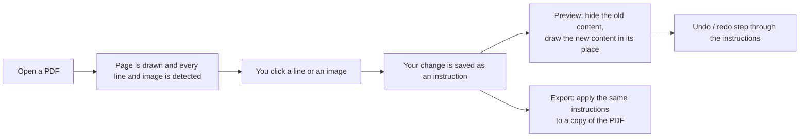
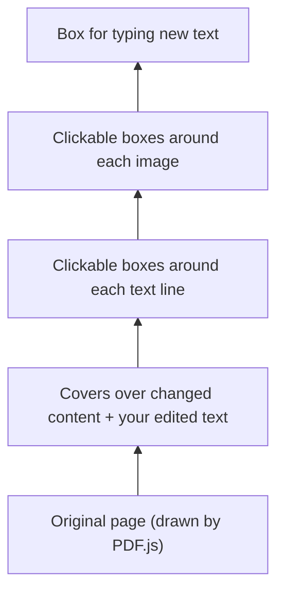
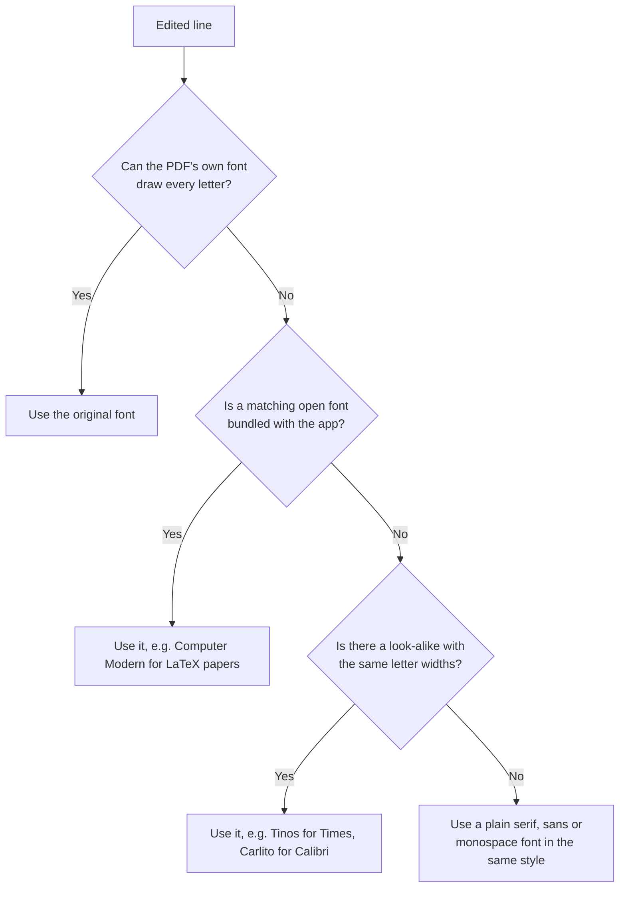

# Seamless PDF

A PDF editor that runs entirely in your browser. Click any text or image on a page, change it where it sits, and download a new PDF that still looks like the original — no uploads, no accounts, no server.

**Try it:** https://emon49.github.io/seamlessPDF/

## Features

- **In-place text editing** — Spotted a typo or an outdated date? Click the line and type the correction in the side panel; you see the change on the page as you type. Seamless PDF keeps the line's font, size, colour and spacing, so the edit blends into the page instead of looking pasted on.
- **Image replacement** — Swap a logo, photo or signature for one of your own. The new image takes the old one's place and size, and you choose whether it should fit inside the frame, fill it, or stretch to it.

## Tech Stack

| Layer | Technology |
|---|---|
| UI framework | React 19 + TypeScript (strict) |
| Styling | Tailwind CSS v4 + Lucide Icons |
| PDF rendering | `pdfjs-dist` (legacy build) |
| PDF export | `pdf-lib` + `@pdf-lib/fontkit` |
| State | Zustand |
| Build | Vite 8 |
| Unit tests | Vitest + Testing Library |
| E2E tests | Playwright |
| Linting | ESLint (flat config) + `eslint-plugin-jsx-a11y` |
| Offline / PWA | `vite-plugin-pwa` |
| Local persistence | IndexedDB (autosave) |

## Prerequisites

- **Node.js 20 or later**
- npm (bundled with Node.js)

## Getting Started

### 1. Clone the repository

```bash
git clone https://github.com/emon49/seamlessPDF.git
cd seamlessPDF
```

### 2. Install dependencies

```bash
npm install
```

### 3. Start the development server

```bash
npm run dev
```

Open [http://localhost:5173](http://localhost:5173) in your browser. The app reloads as you change files.

## Project Structure

```
src/
  components/       React components (PDFViewer, TextOverlay, Sidebar, Header, …)
  store/            Zustand stores (editorStore, useEditor, usePageModel)
  lib/              Pure logic: coordinate helpers, extractors, renderers, exporters
  types/            Shared TypeScript types (PageModel, TextLine, EditOperation, …)
public/fonts/       Self-hosted open fonts used when the original font can't draw an edit
tests/
  unit/             Vitest unit tests (components, lib, store)
  integration/      Node-side PDF.js extraction tests
  e2e/              Playwright end-to-end tests
  fixtures/         Sample PDFs used by tests
docs/
  PRD.md            Product requirements
  adr/              Architecture Decision Records
  featurelist.md    Original complete feature specification
csp.ts              Single Content-Security-Policy source (headers + meta tag)
```

## Architecture Overview

Seamless PDF never changes your original file. Each edit you make is written down as a small instruction ("replace this line", "use this image here"). What you see on screen is the original page with those instructions applied on top, and the downloaded PDF is built from the same instructions. That is also why undo and redo are reliable: they just step back and forth through the list.

### What happens when you edit



### How a page is built on screen

The page you see is several see-through layers stacked on top of each other, all sharing the same position on the page:



### Keeping edits looking original

When you change a line, Seamless PDF tries to draw it in the closest font it can, in this order:



Bold and italic are kept at every step, and the preview and the downloaded PDF always use the same font.

Everything happens on your device. Your document is never uploaded; the only optional outside request is downloading a Google Font, and only after you agree.

See `docs/adr/` for the decisions behind this design and `docs/PRD.md` for the detailed requirements.

## Known Limitations

PDFs come in endless varieties — from Word, LaTeX, design tools, scanners and more — and we have not been able to try every kind. On some files the editor may behave in ways that feel unnatural, such as an edited line looking slightly different from its neighbours or text not lining up perfectly. If you run into anything like that, we would love to hear about it: please email **rafiemon71@gmail.com** with a short description and, if you can, a sample PDF that shows the problem (please remove any personal information first).

Other things to know:

- Hidden text is covered, not deleted: it disappears visually but remains inside the PDF file, so this is not secure redaction.
- Edits apply one line at a time; the rest of a paragraph does not reflow around a longer or shorter line.
- If the PDF does not contain the exact font for a letter you type, a close look-alike is used instead of the exact face.
- Only Latin, Greek and Cyrillic scripts are supported (no right-to-left or complex scripts).
- Rotated or slanted text, such as diagonal watermarks, can be viewed but not edited.
- Password-protected PDFs cannot be opened.
- One object can be selected at a time.
- Phones and tablets are not yet a target.
